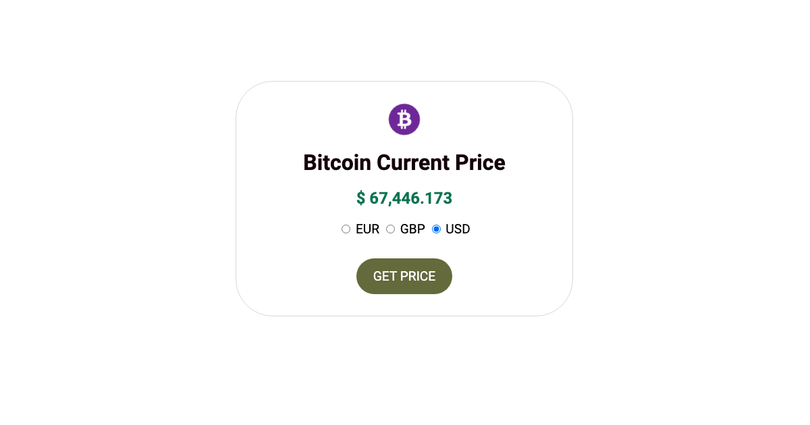

# Bitcoin Current Price Checker

This was a code challenge on an Udemy Course, [The Advanced Web Developer Bootcamp](https://www.udemy.com/course/the-advanced-web-developer-bootcamp/?couponCode=ST13MT40224).

A single page web application that retrieves the current price of Bitcoin in the users choice of EUR, GBP or USD.

## How It Works

This web application utilizes old school XHR requests to retrieve Bitcoin data from the [CoinDesk API](https://cryptocointracker.com/api/coindesk)

1. Select a currency
2. Click the Get Price button

[View Live Project](https://heidifryzell.com/bitcoin-current-price/)
